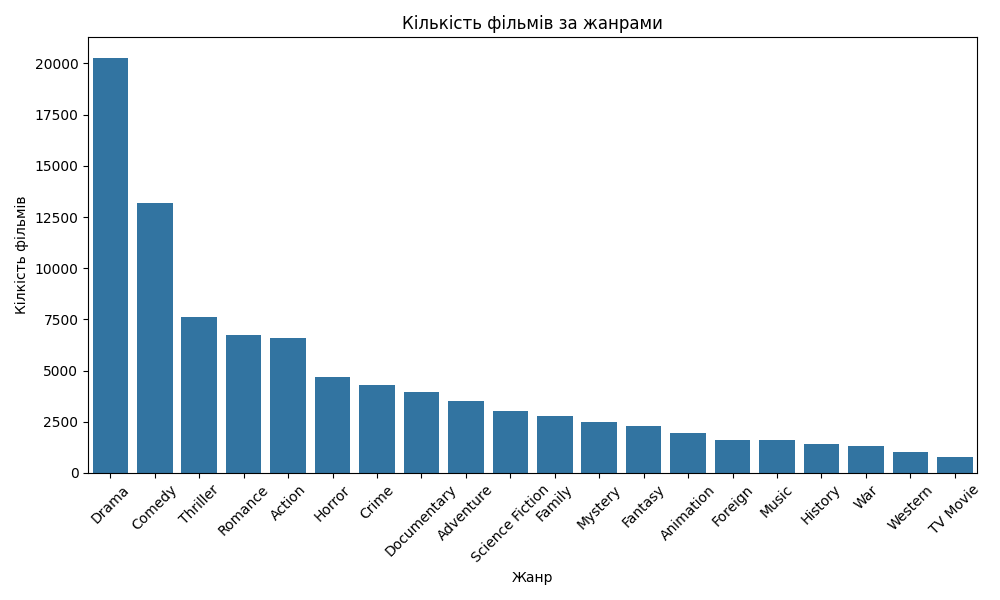
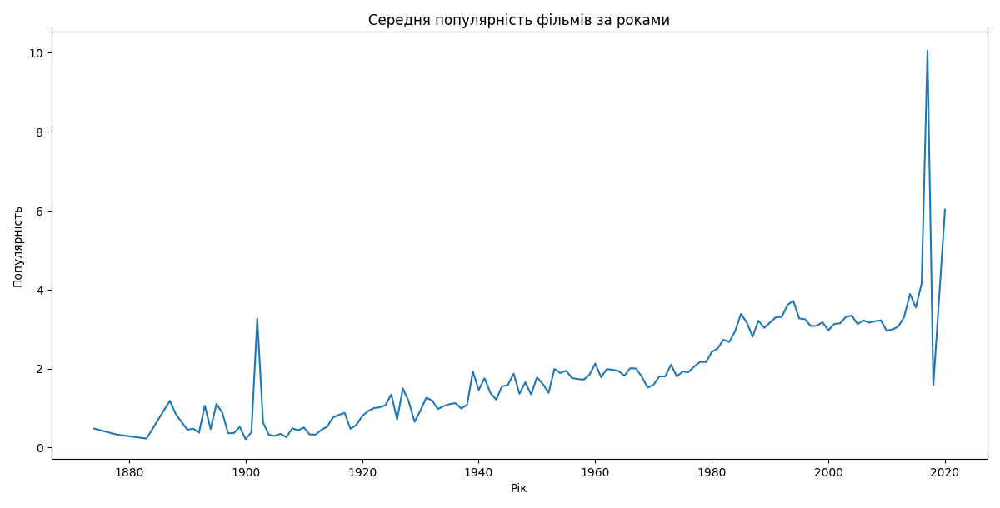
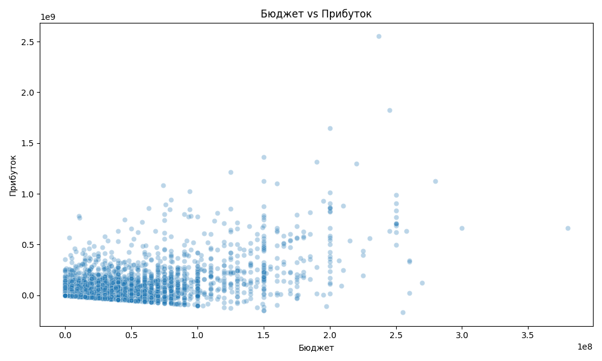

# Аналіз данних кіноіндустрії

Цей проект виконує аналіз датасету (movies_metadata.csv) з 
інформацією про фільм.

Мета: визначити ключові тренди, популярні жанри, зв'язок між 
бюджетом та прибутком, а також дослідити зміни популярності
фільмів за роками.

## Дані

Використаний датасе містить 45,466 зирисів і 24 колонки.

Основні колонки:
- `title`: Назва фільму.
- `budget`: Бюджет фільму.
- `revenue`: Прибуток фільму.
- `release_date`: Дата випуску
- `genres`: Жанр фільму у форматі JSON.
- `ч`: Показник популярності.
- `vote_average`: Середня оцінка.

### Очищення даних
1. Видалено записи без дат, з некоректними бюджетами або прибутками.
2. Розділно дані з JSON-формату на окремі рядки.
3. Додано нові колонки: `release_year` (рік випуску) та `profit` (прибуток).

## Результати

### 1. Популярність Жанрів
Графік нижче демонтрує кількість фільмів для кожного жанру.
Найпопулярніші жанри:
- **Drama**
- **Comedy**
- **Thriller**



### 2. Тренди популярності
З роками популярність фільмів зростає.
Це видно з графіка середньої популярності фільмів за роками:



### 3. Бюджет та прибуток
Залежність між бюджетом і прибутком показує, що високобюджетні
фільми зазвичай більш прибуткові:



## Як повторити аналіз?

1. **Завантажте репозиторій**:
   ```bash
   git clone https://github.com/ShadowOfSokol/LessonFilm.git
   ```
2. **Встановіть залежності**: 

    Переконайтеся, що у вас встановлено Python 3.8+ та бібліотеки:

   ```bash
    pip install pandas matplotlib seaborn
   ```
3. **Запустити скрипт**:
   Виконайте `main.py` для автоматичного аналізу:
   
   ```bash
   python main.py
   ```

4. **Оглянте результат**
   Очищенний датасет буде збережено як `cleaned_movies_metadata.csv`, 
   а графіки - файлах:
   - `genre_popularity.png`
   - `popularity_trend.png`
   - `budget_vs_profit.png`

---
## Контакти

Якщо у вас є запитання, пишіть на email: sokolenkoegor19702002@gmail.com.

Дякуємо, що зацікавилися нашим проєктом!
